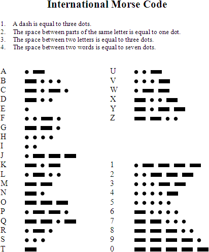

# Morse library

This repository is a simple example to perform the conversion from text to morse. I tested multiple ways to store the morse translation table, and measured the efficiency of each of them by checking how long it takes them to translate the original version of "Don Quixote" ([downloaded from gutenberg.org](http://www.gutenberg.org/ebooks/2000) and stored in "long.txt") from Spanish to Morse.

## Methods and comparison

The first data structure that comes to mind when building a morse dictionary is a map. However, given that the code is small and unlikely to change, storing the data in an array may prove to be more efficient, especially when thinking of this library as a part of a larger program, where the small size of a pair of arrays may make it more likely that the data stays in the cache memory.

In addition to maps and arrays, I want to try storing the information in vectors, which seem a good compromise between the flexibility of maps and the small footprint of arrays, and unordered_maps, which may give a faster search time than maps in this case.

| Data structure | Don Quijote to morse in seconds |
| --- | --- |
| Arrays | ~0.170 s |
| Map | ~0.525 s |
| Vectors | Work in progress |
| Unordered map | Work in progress |

Note: the above times will vary depending on the machine, but their ratio should remain similar.

## Morse conversion table



## Compilation

Compilation and execution of each example:
```bash
g++ *.cpp -o test.exe
./test.exe
```
